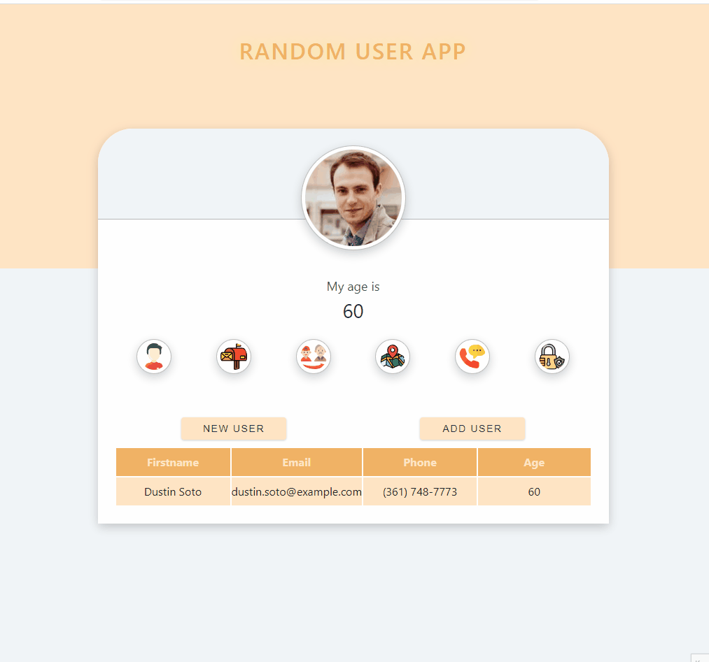

# Random User App - Project Overview

<h3>Visit: https://random-users-app-react.netlify.app</h3>


## Description:

The Random User App is a React-based application that fetches random user data from the "Random User API" and displays it to the user. The application allows users to view information about a random user, such as their name, email, age, address, phone number, and password. Users can also add the displayed user to a list of saved users.

## Project Skeleton

```
Random User App
|
|----readme.md       
SOLUTION
├── public
│     └── index.html
├── src
│    ├── assets.js
│    │       └── [images]
│    ├── App.js
│    ├── App.css
│    ├── index.js
│    └── index.css
├── package.json

```


## Functionality and Components

1. **Fetching Data from API:**
   - The application uses the Axios library to fetch random user data from the "Random User API" (URL: `https://randomuser.me/api/`).
   - The fetched data is stored in the `data` state using the `useState` hook.
   - When the data is being fetched, a loading message is displayed.

2. **Displaying User Information:**
   - The application displays a large image of the random user, along with their name, email, age, street, phone number, and password.
   - By default, the user's name is displayed in the main title area.
   - Users can view different user details by hovering over the icons/buttons representing each type of information (e.g., name, email, age, etc.).
   - When hovering over an icon/button, the corresponding user information is displayed below the icons in the "user-value" paragraph area.
   - The user information and icons change based on the gender of the random user.

3. **Adding Users to List:**
   - Users can click the "add user" button to add the currently displayed random user to the list of saved users.
   - The list of saved users is stored in the `usersList` state, which is initially an empty array.
   - If a user is already added to the list, an alert message informs the user that the user is already added.

4. **New User Button:**
   - Clicking the "new user" button fetches new random user data from the API, and the displayed user's information is updated accordingly.

5. **Table of Saved Users:**
   - The application displays a table showing the first name, email, phone number, and age of each user added to the `usersList`.
   - The table is styled with different colors for the header and each row to improve readability.

## Styling

- The application uses CSS variables to define the primary colors, shades of grey, and other styling values.
- It applies custom styling to the buttons, icons, and the user information container to make the interface more appealing.
- The user's image is displayed in a circular format with a border and a box-shadow effect.
- Hover effects are applied to buttons and icons to provide visual feedback to the user.

## Summary

The Random User App demonstrates the use of React hooks like `useState` and the Axios library to fetch data from an external API. The app also showcases conditional rendering and dynamic updating of content based on user interactions. Users can view various details of random users, add them to a list, and view a summary of saved users in a table format.

The project can serve as a starting point for more complex applications involving data fetching, filtering, and managing lists of users. It provides a practical example of using React to interact with APIs and present data to users in an organized and visually appealing manner.


- You can add additional functionalities and design to your app.

**<p align="center">&#9786; Happy Coding &#9997;</p>**
